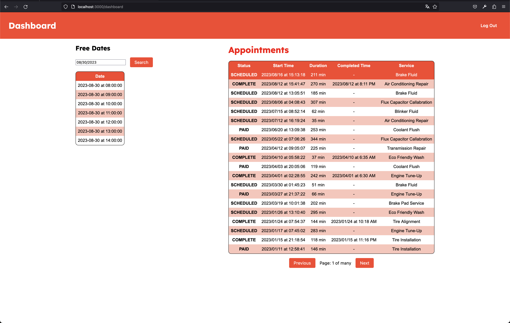

# Curbee Technical Assigment

## Abstract

Hello Curbee Team! My name is Pedro Flores and this is the final result of my technical assignment for trying to work at the company. The projects was developed with ```Next.js v13.4.19```, I also used some libraries like ```SweetAlert2```, ```React Final Form``` and ```Styled Components```. Below I'll try to explain my development process and my final thoughts about this technical assigment.

## Technical Detailment Process (commit description)

1. First I create a fresh instalation from NextJS using typescript as principal language, because I prefer typescript for having good code base with knowledge about the data I need to use and modify. Also I add the styled components library, I really like this library because let me use css components as react components, at first I was working very well but in the developing I was founding some problems with the SSR and I don't have much time to solve it so in the later development I use the css procesor that comes with NextJS. In the end I add the color sheet that comes in the  technical PDF.

2. I add the skeleton for the login form and the header for the app, like this was an early stage the components almost were empty. Basically I just add the css styling.

3. I made the API for the login, before I implemented the call in the front end I used ```Postman``` Mac tool for testing the endpoints, when the endpoints give me a good response I save the schema of the response and made the API calls through NextJS API mechanism. Also in this step I try to handle the ```Bearer Token```.

4. In this step I add a first attempt to build a middleware for handle the ```authorization``` in the app, then I had to install the ```cookies``` and ```cookies-next``` packages to handle the logic for the login flow, further I modify the log in endpoint for manage the ```Bearer Token``` in a better way. Also I installed the ```SweetAlert2``` library for show beatiful modals.

5. In this part I completed the login flow adding the token in some calls, also I started to work with the free dates and appointments through the ```API```.

6. I started to work in the appoinments and availability API calls for handle that logic. In the end I add a ```react date picker``` component because I was having some issues using the vanilla date component. Also I was working on building the free dates component and implement the API for availability.

7. Fix a problem with the appointments API call, also worked in the appointments component, basically I made an API call with postman for knowing the response schema, then implement the main effect in the component for retrieving the data from the API. Also I stared to work in a dashboard skeleton. 

8. Basically I have to add an intermediary (middleware kind of) between the ```login``` and the ```dashboard``` component, this is because I have to handle in the ```localStorage``` and the login I wrote works mainly in the server side, so I have to manage a bridge between the front end and the back end, so this route check if there is an ```saved token```, if that is the case just add it for the session and use it the next ```API calls```. In the end I add a loader spinner that shows when the user has some network problems and the page is loading. In this step basically I finish the authorization requeriment.

9. I think this was the heaviest part because I have to modify a few files and add some conversions between the ```API returned data``` and its ```react representation```, worked with the date format for align in the requeriments, formating the dates for a human readability, create the HTML styled table for showing the result for the appointments and some CSS changes for hover events in the table. Also I add the pagination login on front end and backend calls.

10. Complete CSS atyle for free dates table.

11. Add a header for best look 👌🏽.

12. Add some media queries for try to make it responsive 💅🏽.

13. Add a background image for the login page ✨.

## Project Reflection
1. Did you run into any “gotchas” along the way? If so, what were they and how did you address them? Yes, the most I remember is sharing the ```Bearer Token``` between the front end and the server, for that I have to research a little for validate if the way I was trying to implement was a good choice. Also sometimes the API doesn't work at all, so I have to use my intuition for continue writing code.

2. How did you handle forms? In a largely form-driven project, would you do anything differently? If so, what? I used a React library called ```React final form```, I really enjoy to use it because it gives me in an agnostic way to handle data without set a lot of states, just use the final modifed state when the user ends the edition. Also comes with out-of-the-box cool features like state flags for manage the CSS styling in error flows.

3. How did you handle authorization? In your ideal FE/BE scenario, what auth strategy would you use? For that I used a combination front end and back end flows, the backend gives me the token so the front end has to save it locally for when the user closes the page, can return with out login again, if the front end has the token just send it to the NextJS API for handle in future calls. Also I add a log out flow. In my ideal scenario I would use a third party library like Auth0 for let it to handle the logic and I just worry about the business logic implementation, also it can give us some kind of hard flows implmentation like SSO.

4. Is there anything you’d like to share about your project prior to my evaluating it? There's a little problem with the appointments component, basically when the user comes to the final page it doesn't return the component that represents the final of the list, but I think it could be a problem with the API because yesterday it was working. Also, I think there could be a problem if you change the style from an ```styled-component```, I notice this during the development and in some part I didn't continue using the library, I was checking and it could be a problem with the most recent next version and the styled components library.

5. How long did you spend on this exercise? If you had unlimited more time to spend on this, how would you spend it and how would you prioritize each item?
To be honest a full week complete in partial time, this was because I was doing another work load and I have to manage my time in a partial way, also I have to rest. If I have unlimited time I really like to implement good architecture for access and permissions, made a local library for standard components, also work in a well-tested responsive components, and also, add unit testing.


## Final thoughts
I really enjoy to work in this techical assigment, I think it was a good excersise with a leveled difficult, I tried my best for doing it. Thanks for the Curbee team for give me the opportunity to show this technical assigment.

## Screenshots




## Run the project

First you have to install the project with
```bash
yarn install
```

Second, run the development server:

```bash
yarn run dev
```

